# From Knots to Knobs: Towards Steerable Collaborative Filtering Using Sparse Autoencoders

Official repository for the paper *"From Knots to Knobs: Towards Steerable Collaborative Filtering Using Sparse Autoencoders"*.

This repository contains the implementation, experiment configuration, and reproducibility instructions for our method using sparse autoencoders to build interpretable, steerable collaborative filtering models. It also includes extended results and analyses beyond what could be included in the paper.

### Try our method in an [interactive demo](https://steerable-collaborative-filtering.streamlit.app/).

## Table of Contents
- [Method Overview](#method-overview)
- [Experimental Results](#experimental-results)
- [Reproducibility Details](#reproducibility-details)

## Method Overview
Our approach augments a pretrained collaborative filtering autoencoder (CFAE) with a sparse autoencoder (SAE) that disentangles and expands its latent user representations into a higher-dimensional, sparsely activated space. This enables neuron-level interpretability and controllable steering of recommendations by mapping semantic concepts to individual SAE neurons and modifying their activations at inference time.

### Pseudocode
#### Inputs and Outputs
```
Inputs
  X = training user-item interaction matrix
  M = item metadata (used only for neuron labeling)

Outputs
  Trained CFAE (encoder Ec, decoder Dc)
  Trained SAE (encoder Es, decoder Ds)
  Concept-neuron mapping
  Steering interface for controllable CF
```

#### Stage 1 - Train CFAE on raw interaction data
```
# Initialize models
Ec, Dc = init_CFAE()

# Train CFAE
for x in minibatches(X):
    z = Ec(x)
    x_recon = Dc(z)
    loss_c = reconstruction_loss(x, x_recon)
    update(Ec, Dc, loss_c)

# Freeze CFAE encoder
freeze(Ec)

# Compute dense user embeddings
U = Ec(X)
```

#### Stage 2 - Train SAE on frozen CFAE embeddings
```
Es, Ds = init_SAE()

for u in minibatches(U):
    y = Es(u)           # sparse latent code
    u_recon = Ds(y)
    loss_s = reconstruction_loss(u, u_recon) + sparsity_penalty(y)
    update(Es, Ds, loss_s)

# Ec stays frozen in all SAE training
```

#### Stage 3 - Neuron labeling (concept-neuron mapping)
```
S_item = {}

for item_id in all_items():
    onehot_vec = one_hot(item_id)
    emb = Ec(onehot_vec)
    sparse_code = Es(emb)
    S_item[item_id] = sparse_code

# Build tag-item distribution from metadata
tag_item_matrix = build_tag_item_matrix(M)

# Compute tag-neuron activation matrix
activation_matrix = tag_item_matrix @ item_to_neuron_matrix(S_item)

# Compute neuron-tag relevance scores (e.g., TF-IDF)
concept_labels = compute_tfidf_labels(activation_matrix)
```

#### Stage 4 - Steering (integration into CFAE)
```
# Nested model: CFAE encoder -> SAE -> CFAE decoder
def CFAE_with_SAE(x):
    return Dc(Ds(Es(Ec(x))))

# Steering interface
def steer(x, neuron_id, alpha):
    z = Es(Ec(x))                 # sparse code
    z_target = one_hot(neuron_id)
    z_mod = (1 - alpha) * normalize(z) + alpha * z_target
    return Dc(Ds(z_mod))
```


## Experimental Results
### Reconstruction Accuracy Experiments (Section 4.2)

Our reconstruction accuracy experiments (Figure 2) show that TopK SAEs recover cosine-like CFAE embeddings (ELSA) with high fidelity and minimal downstream degradation, while achieving a much more stable sparsity-accuracy trade-off than Basic SAEs. **Crucially for applications**, variational embeddings produced by MultVAE are substantially harder to reconstruct, resulting in significant loss of accuracy under SAE-based reconstruction in both the ML-25M and MSD datasets.

The following plots showcase the effect of sparsification parameters on the activation density (left), reconstruction cosine similarity (center), and downstream recommendation accuracy (nDCG@20; right). All variants use 1024 dimensional backbones. Extended results (backbone dimension ranging between 256 and 2048; downstream accuracy measured in terms of Recall@20) are available in the [figures](./results/figures/reconstruction_accuracy/) directory.
##### ML-25M
<!-- <p align="center">
  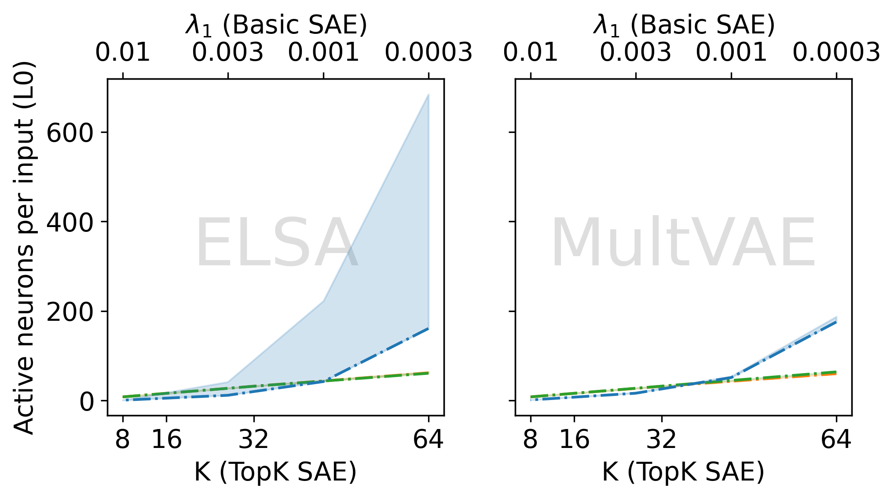
  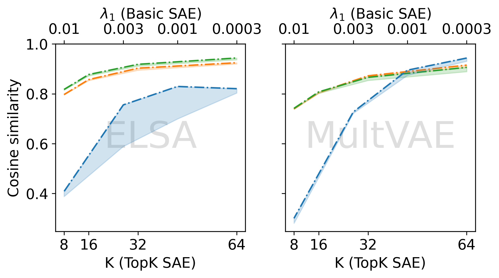
  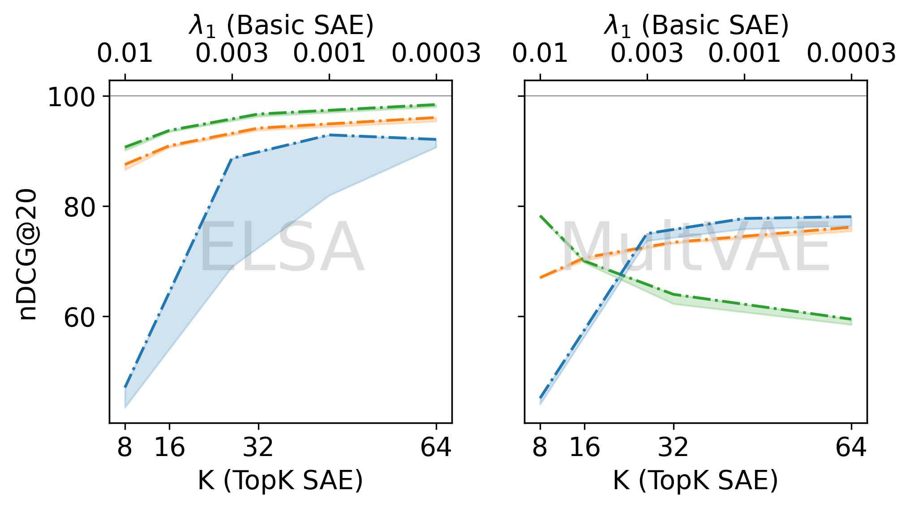
</p> -->
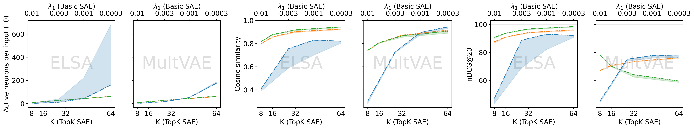

##### MSD
<!-- <p align="center">
  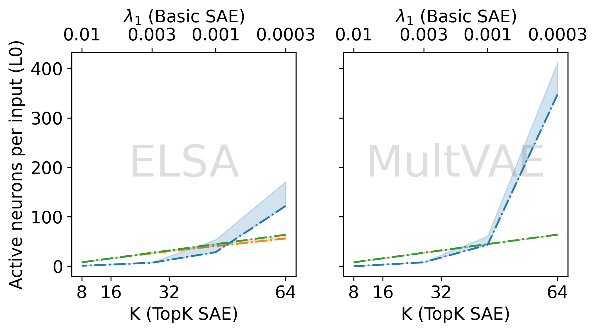
  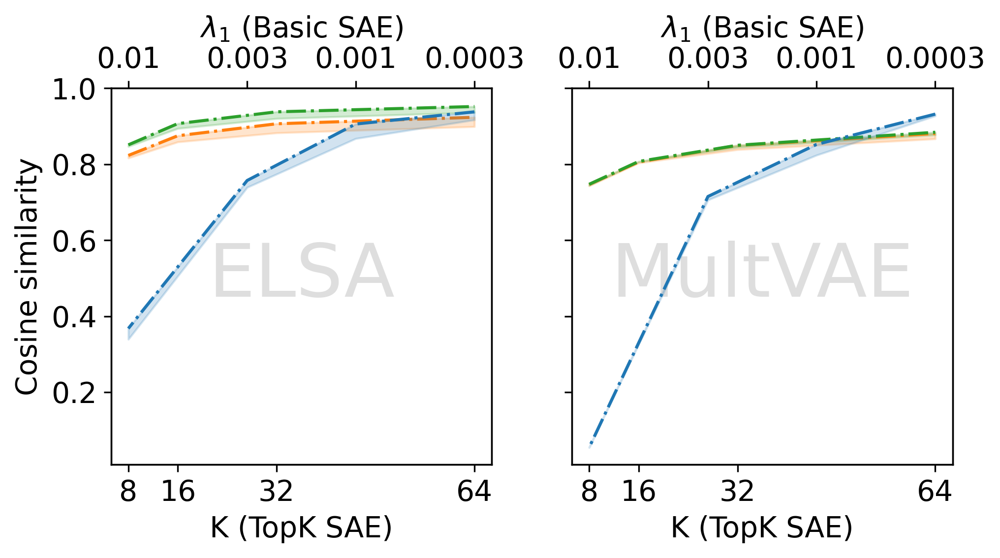
  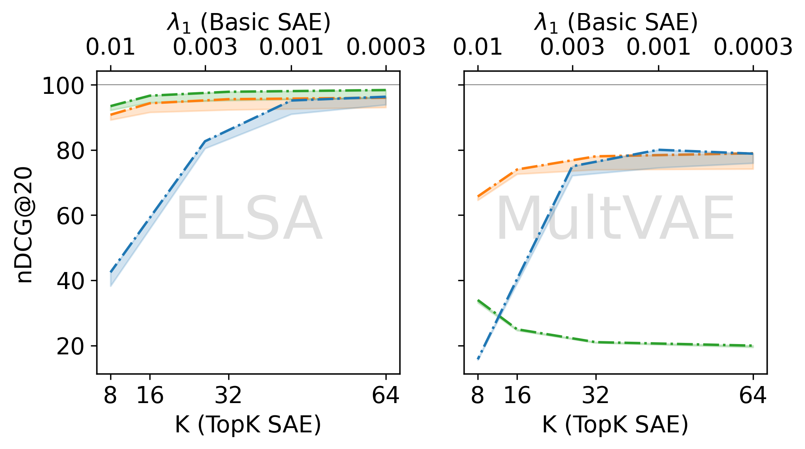
</p> -->
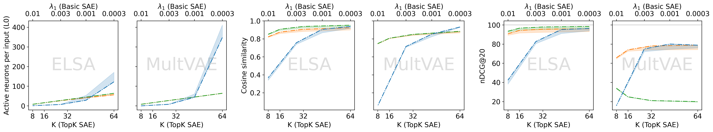

Reproducibility details can be found [here](#reconstruction-accuracy-experiments).

### Neuron Interpretability Experiments (Section 4.3)

#### Selectivity of neuron activations for tags (Table 2)

The following tables list metadata tags with the highest and lowest (bottom-most row; <span style="color: #d4aa00;">yellow</span>) KL divergence from the average activation distributions over all tags. 

##### ML-25M
In all three models, items tagged with *Quentin Tarantino* show one of the most diverse activation patterns among all tags. Also, *James Bond* and *Coen brothers* were listed by two out of three models. On the other hand, *boring* was identified by two out of three models as the least informative.

<table>
<tr>

<td style="vertical-align: top; padding-right: 20px;">

<p align="center"><b>MultVAE + L2</b></p>
<table>
<tr><th>Tag</th><th>Entropy</th><th><em>D</em><sub>KL</sub></th></tr>
<tr><td>james bond</td><td>2.06</td><td>14.30</td></tr>
<tr><td>quentin tarantino</td><td>2.86</td><td>14.24</td></tr>
<tr><td>studio ghibli</td><td>1.67</td><td>14.16</td></tr>
<tr><td>star trek</td><td>1.64</td><td>14.01</td></tr>
<tr><td>robert rodriguez</td><td>1.90</td><td>14.00</td></tr>

<tr>
  <td><span style="color:#d4aa00;">boring</span></td>
  <td><span style="color:#d4aa00;">5.44</span></td>
  <td><span style="color:#d4aa00;">5.76</span></td>
</tr>

</table>

</td>

<td style="vertical-align: top; padding-right: 20px;">

<p align="center"><b>ELSA + L2</b></p>
<table>
<tr><th>Tag</th><th>Entropy</th><th><em>D</em><sub>KL</sub></th></tr>
<tr><td>quentin tarantino</td><td>4.65</td><td>14.60</td></tr>
<tr><td>wes anderson</td><td>4.09</td><td>14.25</td></tr>
<tr><td>stanley kubrick</td><td>4.50</td><td>14.20</td></tr>
<tr><td>monty python</td><td>3.52</td><td>14.04</td></tr>
<tr><td>coen brothers</td><td>4.81</td><td>13.99</td></tr>

<tr>
  <td><span style="color:#d4aa00;">boring</span></td>
  <td><span style="color:#d4aa00;">7.33</span></td>
  <td><span style="color:#d4aa00;">3.15</span></td>
</tr>

</table>

</td>

<td style="vertical-align: top;">

<p align="center"><b>ELSA + Cosine</b></p>
<table>
<tr><th>Tag</th><th>Entropy</th><th><em>D</em><sub>KL</sub></th></tr>
<tr><td>quentin tarantino</td><td>4.90</td><td>14.34</td></tr>
<tr><td>coen brothers</td><td>5.21</td><td>14.20</td></tr>
<tr><td>james bond</td><td>5.18</td><td>14.20</td></tr>
<tr><td>tim burton</td><td>5.28</td><td>14.10</td></tr>
<tr><td>jim carrey</td><td>5.17</td><td>14.07</td></tr>
<tr>
  <td><span style="color:#d4aa00;">bd-r</span></td>
  <td><span style="color:#d4aa00;">8.22</span></td>
  <td><span style="color:#d4aa00;">2.65</span></td>
</tr>

</table>

</td>

</tr>
</table>

##### MSD
All tags identified as producing the most distinctive sparse activation patterns represent niche music genres. Notably, *stand-up*, a non-rhythmic genre (spoken word), was identified among its top five tags by two out of three models. By contrast, *favorites* was identified as the least informative by two out of three models.
<table>
<tr>

<td style="vertical-align: top; padding-right: 20px;">

<p align="center"><b>MultVAE + L2</b></p>
<table>
<tr><th>Tag</th><th>Entropy</th><th><em>D</em><sub>KL</sub></th></tr>
<tr><td>Reggaeton</td><td>2.61</td><td>14.21</td></tr>
<tr><td>Rock Argentino</td><td>3.59</td><td>14.10</td></tr>
<tr><td>bluegrass</td><td>3.56</td><td>13.92</td></tr>
<tr><td>hardstyle</td><td>0.67</td><td>13.89</td></tr>
<tr><td>worship</td><td>3.54</td><td>13.64</td></tr>

<tr>
  <td><span style="color:#d4aa00;">favorites</span></td>
  <td><span style="color:#d4aa00;">7.23</span></td>
  <td><span style="color:#d4aa00;">2.75</span></td>
</tr>

</table>

</td>

<td style="vertical-align: top; padding-right: 20px;">

<p align="center"><b>ELSA + L2</b></p>
<table>
<tr><th>Tag</th><th>Entropy</th><th><em>D</em><sub>KL</sub></th></tr>
<tr><td>Kiwi</td><td>2.73</td><td>13.20</td></tr>
<tr><td>balkan</td><td>4.10</td><td>13.14</td></tr>
<tr><td>mashup</td><td>3.24</td><td>13.06</td></tr>
<tr><td>celtic punk</td><td>4.00</td><td>12.86</td></tr>
<tr><td>stand-up</td><td>3.42</td><td>12.83</td></tr>

<tr>
  <td><span style="color:#d4aa00;">favorites</span></td>
  <td><span style="color:#d4aa00;">8.52</span></td>
  <td><span style="color:#d4aa00;">0.61</span></td>
</tr>

</table>

</td>

<td style="vertical-align: top;">

<p align="center"><b>ELSA + Cosine</b></p>
<table>
<tr><th>Tag</th><th>Entropy</th><th><em>D</em><sub>KL</sub></th></tr>
<tr><td>rock chileno</td><td>4.27</td><td>13.20</td></tr>
<tr><td>bachata</td><td>3.48</td><td>13.16</td></tr>
<tr><td>stand-up</td><td>2.93</td><td>13.07</td></tr>
<tr><td>J-rock</td><td>4.33</td><td>13.00</td></tr>
<tr><td>turkish</td><td>3.66</td><td>13.00</td></tr>

<tr>
  <td><span style="color:#d4aa00;">rock</span></td>
  <td><span style="color:#d4aa00;">8.76</span></td>
  <td><span style="color:#d4aa00;">0.88</span></td>
</tr>

</table>

</td>

</tr>
</table>

#### KL divergence and entropy decrease of tags and neurons (Figure 3)
For the `Tags to Neurons` direction, relative entropy decrease is defined as $(H-H_t)/H$, where $H_t$ is the entropy of a tag's distribution of neuron activations, while $H$ is the entropy of the average distribution over all tags. The other direction is defined analogously. 

The results show a remarkably similar behavior of the three variants when comparing the results across the two datasets from different domains (movies and music).

##### ML-25M
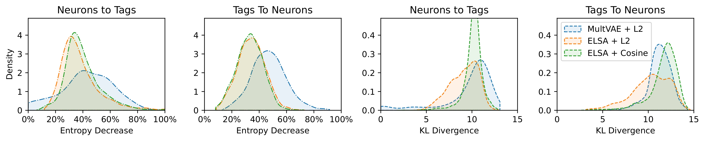

##### MSD
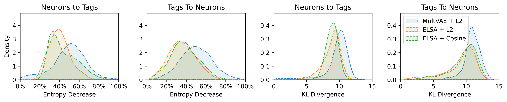

Reproducibility details can be found [here](#neuron-interpretability-experiments).

### Steering Experiments (Section 4.4)
#### Quantitative evaluation (Figure 5)
Steering experiments show that activating concept-aligned SAE neurons induces smooth, directed shifts in user embeddings and recommendations, with ML-25M (left) and MSD (right) exhibiting essentially identical qualitative behavior. Notably, the MultVAE fragility observed in Section 4.2 also appears in downstream steering accuracy, where its responses are less stable and less aligned with the intended semantic direction.

<!-- <p align="center">
  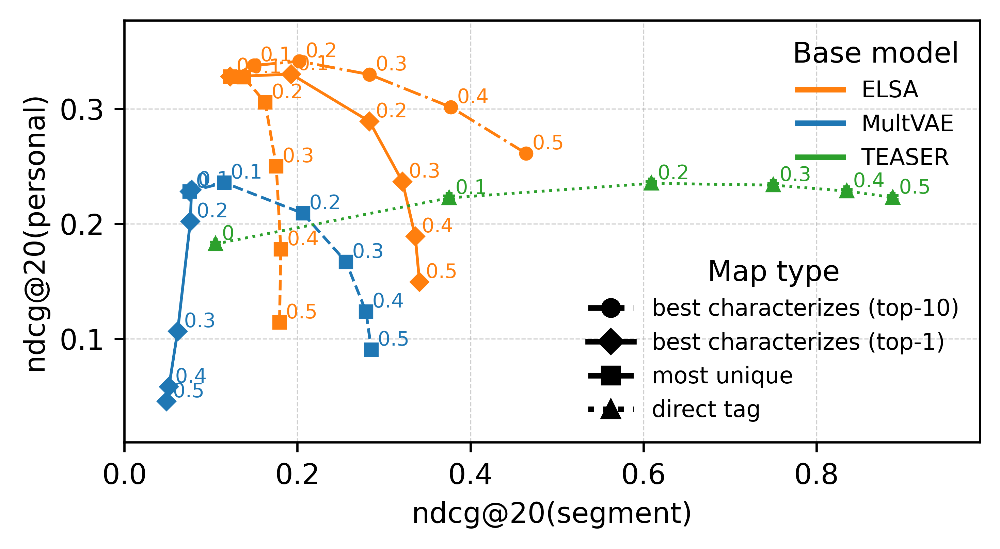
  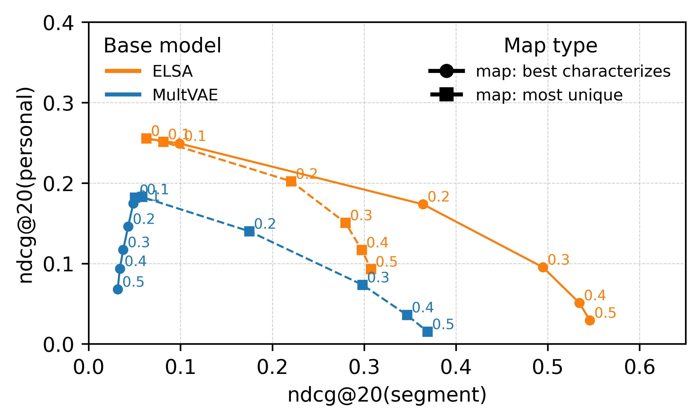
</p> -->
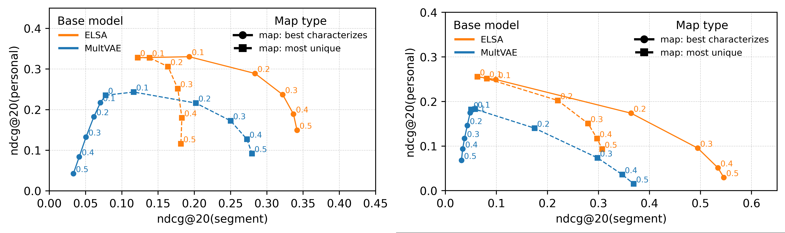

Reproducibility details can be found [here](#steering-experiments).


## Reproducibility Details

### Environment Setup
```bash
conda create -y -n sae python=3.11
conda activate sae

pip install -r requirements.txt
```

### Datasets

#### [MovieLens 25M (**ML-25M**)](https://grouplens.org/datasets/movielens/25m/)
The MovieLens-25M dataset is a large-scale collection of 25 million user-movie ratings, timestamps, and metadata curated by GroupLens for research in collaborative filtering and recommender systems. To download the dataset, run
```bash
bash download_ML-25M_dataset.sh
```
#### [Million Song Dataset (**MSD**)](http://millionsongdataset.com/tasteprofile/)
The Taste Profile subset of the Million Song Dataset contains millions of user-track play counts reflecting real-world listening preferences, commonly used for building and evaluating music recommendation models. To download the data, run
```bash
bash download_MSD_dataset.sh
```
##### Last.fm Tag Metadata for MSD

To enrich the Million Song Dataset with interpretable tags, we use the **Last.fm tagging dataset** ([link](http://labrosa.ee.columbia.edu/~dpwe/tmp/lastfm_tags.db)), which provides user-assigned tags for tracks. The tag database contains Last.fm tags indexed by track name and artist. To align these tags with the Taste Profile subset, we join the two datasets using the metadata in `unique_tracks.txt` ([link](http://millionsongdataset.com/sites/default/files/AdditionalFiles/unique_tracks.txt.zip)), which maps MSD track IDs to `(artist, title)` pairs. After performing this join, we obtain two CSV files used throughout our notebooks:

- `song_names.csv` - mapping from MSD track IDs to `(artist, title)`  
- `song_tag_assignment.csv` - sparse assignment matrix of tags to tracks  

Both files should be placed under `data/MSD/`.

### Model Training
#### Training ELSA Model
```bash
python train_elsa.py --dataset DATASET_NAME --embedding_dim EMBEDDING_DIM
```
See [train_elsa.py](train_elsa.py) for additional arguments and [elsa.py](elsa.py) for implementation.

#### Training MultVAE Model
```bash
python train_multvae.py --dataset DATASET_NAME --embedding_dim EMBEDDING_DIM
```
See [train_multvae.py](train_multvae.py) for additional arguments and [multvae.py](multvae.py) for implementation.

#### Training SAE Model
Our SAEs are trained on user embeddings generated by a pretrained ELSA model. To train the SAE, you need to provide a pretrained ELSA checkpoint, which will generate the user embeddings.
```bash
python train_sae.py --dataset DATASET_NAME --pretrained_model_checkpoint PRETRAINED_MODEL_CHECKPOINT --embedding_dim EMBEDDING_DIM
```
See [train_sae.py](train_sae.py) for additional arguments and [sae.py](sae.py) for implementation.

#### Checkpoints
Training jobs store checkpoints after improving on validation loss. Each checkpoint file contains
- the training job config,  
- the model and optimizer states, and 
- the number of completed epochs.

The checkpoint files use the following naming structure:
```
MODEL_CLASS-EMBEDDING_DIM-HASH.ckpt  # e.g., ELSA-512-92a7c516.ckpt
```
where HASH is the first 8 characters of the SHA256 fingerprint of the serialized job config. Only the `model_class` and `embedding_dim` are apparent from the naming. To inspect the full config stored in the checkpoint, run
```bash
python -c "from util import load_config_from_checkpoint; filepath='checkpoints/DATASET_NAME/CHECKPOINT_FILE'; print(load_config_from_checkpoint(filepath))"
```

### Experiments
#### Reconstruction Accuracy Experiments
##### Model Training
- CF models were trained using [run_cf_model_training.sh](run_cf_model_training.sh)
- SAE models were trained using [run_sae_model_training.sh](run_sae_model_training.sh)
- TopK SAE with Cosine loss were trained using [run_topksae_cosine_model_training.sh](run_topksae_cosine_model_training.sh)

Each file lists the used hyperparameters.
##### Evaluation
- Each training job computed the evaluation after completing. Full evaluation outputs are stored in JSON format in the [results](./results/) folder.
- The figure was created from the results using [results/training_run_results.ipynb](results/training_run_results.ipynb). This notebook also allows detailed inspection of the results dataframe.

#### Neuron Interpretability Experiments
- `calculate_mapping_with_tfidf_DATASET.ipynb` contains implementation of our neuron labeling method and evaluation of the labeling accuracy.
- `visualize_data_DATASET.ipynb` was used to generate tables and figures.
##### ML-25M
See [calculate_mapping_with_tfidf_ML-25M.ipynb](calculate_mapping_with_tfidf_ML-25M.ipynb) and [visualize_data_ML_25M.ipynb](visualize_data_ML-25M.ipynb).
##### MSD
See [calculate_mapping_with_tfidf_MSD.ipynb](calculate_mapping_with_tfidf_MSD.ipynb) and [visualize_data_MSD.ipynb](visualize_data_MSD.ipynb).

#### Steering Experiments

##### ML-25M
- **Quantitative evaluation:** [steering_evaluation_ML-25M.ipynb](steering_evaluation_ML-25M.ipynb) implements user-level steering toward metadata-defined segments under increasing steering strength.

- **Qualitative evaluation:** [explanations_and_steering.ipynb](explanations_and_steering.ipynb) produces the item-level examples of concept-aligned boosts shown in Figure 4. The UMAP plots showing how embeddings move toward regions anchored by representative items (Figure 6; Appendix) were generated using [global_steering_effect.ipynb](global_steering_effect.ipynb).

##### MSD
- **Quantitative evaluation:** See [steering_evaluation_MSD.ipynb](steering_evaluation_MSD.ipynb).
